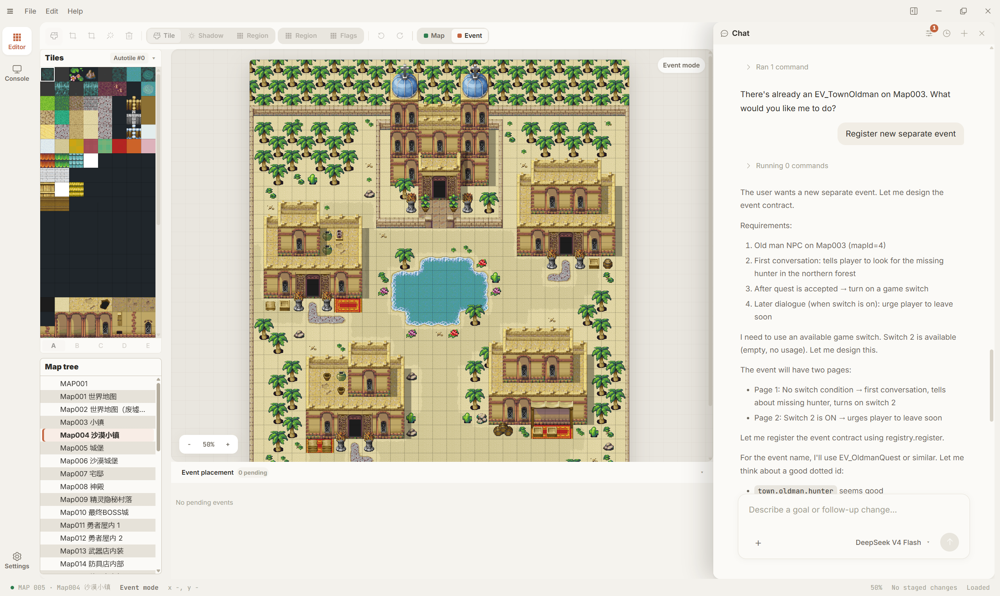
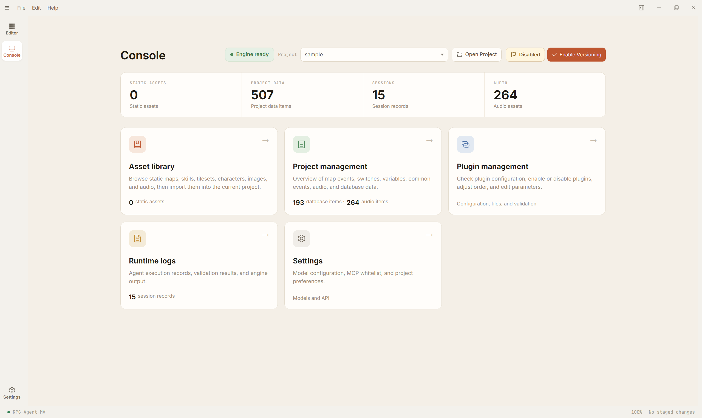

# RPG Agent MV

English | [简体中文](README.zh-CN.md)

A local AI production assistant for individual RPG Maker MV and RPG Maker MZ 1.10.0 creators.

RPG Agent MV turns natural-language production goals into engine-correct event work, script edits, and controlled batch changes inside an existing MV or MZ project. The product name remains RPG Agent MV, while the project engine is detected automatically.


[User Guide](docs/en/README.md) | [Quick Start](#quick-start) | [Run From Source](#run-from-source) | [Project Boundaries](#project-boundaries)

## Preview

| Home | Console |
|---|---|
|  |  |

## What It Does

### Generate Event Drafts From Natural Language

Describe an NPC, a story beat, a quest hint, a signpost, a trigger, or a small scene. The Agent reads the current project context and prepares RMMV-compatible event content.

Good first tasks include:

- A villager NPC with dialogue and a follow-up branch.
- A quest start, quest update, or quest completion event.
- A chest, transfer point, signpost, or story trigger.
- A new event draft based on maps and assets that already exist in the project.

New events are not placed automatically at guessed coordinates. The Agent prepares or registers the event, then the user reviews it and places it on the RPG Agent MV desktop map canvas.

### Batch-Edit Existing Events

When a project already has many maps and events, describe the change in natural language and let the Agent read project facts before applying controlled edits.

Typical uses:

- Make a group of NPC greetings more consistent.
- Add similar switch, variable, or condition logic to multiple events.
- Clean up signposts, shops, transfer points, or quest events.
- Find old event logic that looks inconsistent and organize it.

### Assist With Scripts and Plugin-Related Logic

RPG Maker projects often need JavaScript edits, plugin parameter checks, or small utility scripts. RPG Agent MV can inspect the project state and help write or adjust code using the selected project's MV or MZ format.

Typical uses:

- Write a small script command for repeated project logic.
- Adjust an existing plugin call.
- Find where a menu, battle, item, or event behavior comes from.
- Suggest a script edit based on the current project state.

### Understand The Current Project

RPG Agent MV works around the selected RPG Maker MV or MZ project. It reads maps, events, assets, database entries, plugins, switches, variables, and other project context instead of generating isolated text.

This makes it better suited to daily production work in an existing game project, such as: "make the NPCs in this town sound more like frontier-town residents."

## Project Boundaries

RPG Agent MV is not a full game generator and it does not replace the RPG Maker editor.

It does not currently promise to:

- Generate a complete game from scratch.
- Automatically generate maps, art, audio, or missing assets.
- Fully understand every third-party plugin's semantics.
- Decide exact coordinates for new events without user placement.
- Replace the creator's judgment about story, characters, staging, or final quality.

It is meant to reduce repetitive production work: placing production goals into a real project, reviewing the result, and keeping changes visible and reversible.

### Engine Compatibility

- Existing RPG Maker MV support remains available.
- RPG Maker MZ 1.10.0 is the fully validated baseline. Recognizable older MZ projects may be imported and edited after an explicit compatibility warning; the warning appears again before staged changes are written unless the user chooses not to see future compatibility warnings.
- Project markers are optional. Core scripts, data layout, tile size, canvas size, and encryption state are detected automatically. Encrypted projects may be loaded after a warning, while encrypted asset listing, preview, replacement, and validation can remain limited.
- Mixed MV/MZ files, conflicting data layouts, missing required project data, and unrecognizable core versions are rejected before writes.
- MZ 1.10.0 remains the fully validated playtest baseline. The top-bar Play action allows another recognizable MZ core version to attempt a launch with a complete MZ runtime, but the result is compatibility evidence for that run rather than a support guarantee. Isolated runtime validation remains on the strict baseline.
- Editing works from a source-only RPG Maker MV/MZ project. The top-bar Play action first uses a complete runtime beside the project. Source-only MZ projects can borrow `nwjs-win/nw.exe` selected once from a local RPG Maker MZ installation; source-only MV projects first try the standard installed `nwjs-win/Game.exe` and ask for it only when necessary. The app remembers each engine separately, never copies the runtime, searches arbitrary game folders, or downloads a runner. Isolated Battle Test keeps its stricter project-local runtime boundary.

## Quick Start

1. Prepare a complete RPG Maker MV or MZ project directory with readable project data and core scripts. MZ 1.10.0 is the fully validated baseline; recognizable older cores and encrypted resources require explicit confirmation.
2. Start the RPG Agent MV desktop app.
3. Configure a model provider and API key in Settings.
4. Select your RMMV project.
5. Describe the event, batch edit, or script task in natural language.
6. Review the generated result before applying or keeping it.

Example requests:

```text
Prepare a placeable old-man NPC event for Map003.
On the first conversation, he tells the player to look for the missing hunter in the northern forest.
After the quest is accepted, turn on a switch; later dialogue should urge the player to leave soon.
```

```text
Rewrite ordinary villager greeting lines so they sound more like frontier-town residents.
Keep existing quest hints and shop behavior. Do not change key story NPCs.
```

```text
Write a script command:
based on variable 12, give the player that many healing potions, and show a message if there are none.
```

## Run From Source

### Requirements

- Windows
- Node.js 22.5 or later
- npm
- A complete RPG Maker MV or MZ project directory; MZ 1.10.0 is the fully validated baseline

### Install Dependencies

From the `RPG-Agent-MV` root:

```powershell
cd RPG-Agent-MV
npm run install:deps
```

If you want to use the local Agent directly from source, or build an installer on the current machine, explicitly build the runtime tool once:

```powershell
npm run build:opencode-runtime
```

### Start The Desktop App

After dependencies are installed, run:

```powershell
npm --prefix src/ui/desktop run dev
```

For automated Electron UI checks and screenshots, start the dedicated hidden validator instead. It uses the primary display's work area for maximized-layout coverage, stays non-focusable and hidden, and never controls the normal desktop window:

```powershell
npm --prefix src/ui/desktop run dev:ui-control
```

## Repository Layout

```text
RPG-Agent-MV/
├─ config/              # Agent, provider, and runtime configuration
├─ data/                # Persistent application data
├─ docs/                # User documentation
├─ projects/            # Local RMMV project drop zone; only README is tracked
├─ runtime/             # Sessions, logs, traces, temporary output, and local secrets
├─ src/
│  ├─ backend/          # Project detection, indexing, Agent orchestration, and checks
│  ├─ contract/         # Shared frontend/backend types and protocols
│  ├─ py/               # Python helper capabilities
│  └─ ui/desktop/       # Electron desktop app
├─ third_party/         # Third-party source and runtime provenance
└─ package.json
```

## Documentation

| Document | Contents |
|---|---|
| [English User Guide](docs/en/README.md) | English first-use guide and setup troubleshooting |
| [中文用户手册](docs/README.md) | Full Chinese user guide |
| [Installation](docs/en/getting-started/installation.md) | Requirements, startup flow, and first checks |
| [First Task](docs/en/getting-started/quickstart.md) | A safe first event-generation workflow |
| [Project Setup](docs/en/projects/project.md) | Selecting and managing an RMMV project |
| [Model and Runtime Checks](docs/en/faq/model-check.md) | Troubleshooting model and runtime failures |

## Community

The current community channel is Chinese-language:

- QQ group: 943573784

## License

Apache-2.0

Project-owned code, backend code, and desktop wrapper code are licensed under Apache-2.0. Distributed builds include [THIRD_PARTY_NOTICES.txt](THIRD_PARTY_NOTICES.txt), which documents third-party components, runtimes, and dependencies shipped with the product.

RPG Agent MV is an independent third-party tool designed to work with RPG Maker MV and supported RPG Maker MZ projects.
